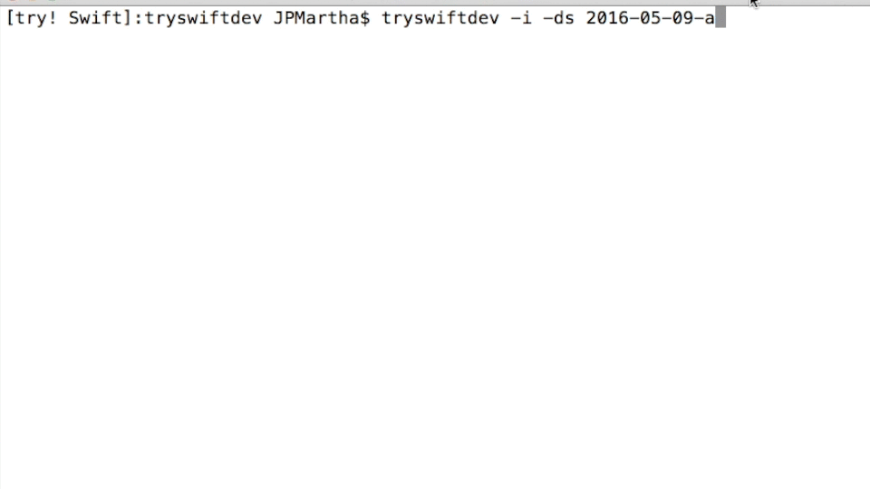

# Development Snapshots Installer 📥

### _**Make Easy for You to Install New Development Snapshots**_

- _**It downloads a specified Developer Snapshot into your current working directory.**_
- _**It installs the package via the `sudo` command.**_
- _**It removes the pkg file.**_

<br />



<br />

### A Work In Progress 👷

⚠️ **Please note!**

This is still in early design and development. 🙏

<br />

## Example

### Install a Development Snapshot via _tryswiftdev_

If you need `swift-DEVELOPMENT-SNAPSHOT-2016-05-09-a-osx.pkg`, please specify `2016-05-09-a`.

```
$ tryswiftdev -i -ds 2016-05-09-a
```

<br />

### Result

```bash
Downloading...

  % Total    % Received % Xferd  Average Speed   Time    Time     Time  Current
                                 Dload  Upload   Total   Spent    Left  Speed
100  228M  100  228M    0     0  4975k      0  0:00:47  0:00:47 --:--:-- 5200k


Installing...

Password:
installer: Package name is Swift Open Source Xcode Toolchain
installer: Upgrading at base path /
installer: The upgrade was successful.


Removing...
```

<br />

## Availability

- Swift 3.0-dev
- OS X

<br />

## ToDo

- [ ] Error Handling
- [ ] Tests

etc.
