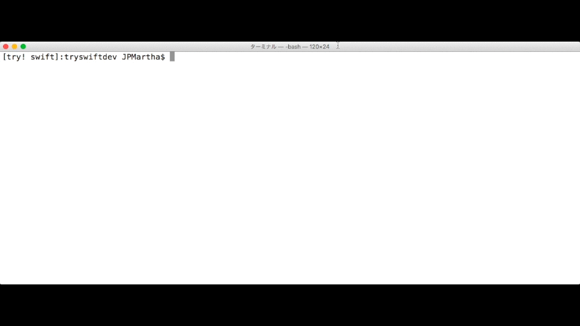

# Find It 🔍

### _Help You Out of "image not found"_

- _**"Find It" searches for a specified file in some directories.**_
- _**It makes easy for you to compare your Xcode Build Settings and find a mistake.**_

<br />



<br />

### A Work In Progress 👷

For now, support `$ tryswiftdev -f -name <value>` only. 🙏

<br />

## Example

### Building your project _Pokemon_ with Xcode

```
ld: framework not found sourcekitd
clang: error: linker command failed with exit code 1 (use -v to see invocation)
```

### 🤔

<br />

### Running your project _Pokemon_ with Xcode

```
dyld: Library not loaded: @rpath/sourcekitd.framework/Versions/A/sourcekitd
  Referenced from: /usr/local/bin/pokemon
  Reason: image not found
```

### 🙄

<br />

### Finding it with _tryswiftdev_

_**tryswiftdev**_ gets Xcode Build Settings value from a Xcode project in the current directory.

```bash
$ cd Pokemon
$ tryswiftdev -f -name sourcekitd.framework
```

```
Searching... /Applications/Xcode.app/Contents
Searching... /Library/Developer
Searching... /Library/Frameworks

Found it!

  - /Applications/Xcode.app/Contents/Developer/Toolchains/XcodeDefault.xctoolchain/usr/lib/sourcekitd.framework
  - /Library/Developer/Toolchains/swift-2.2-SNAPSHOT-2016-03-01-a.xctoolchain/usr/lib/sourcekitd.framework
  - /Library/Developer/Toolchains/swift-DEVELOPMENT-SNAPSHOT-2016-05-03-a.xctoolchain/usr/lib/sourcekitd.framework

Your `Runpath Search Paths`(LD_RUNPATH_SEARCH_PATHS):
  - /Library/Developer/Toolchains/swift-DEVELOPMENT-SNAPSHOT-2016-05-03-a.xctoolchain/usr/lib/swift/macosx

Your `Framework Search Paths`(FRAMEWORK_SEARCH_PATHS):
  - (empty)
```

### One of the following paths could be correct path. 😇

- `/Applications/Xcode.app/Contents/Developer/Toolchains/XcodeDefault.xctoolchain/usr/lib`
- `/Library/Developer/Toolchains/swift-2.2-SNAPSHOT-2016-03-01-a.xctoolchain/usr/lib`
- `/Library/Developer/Toolchains/swift-DEVELOPMENT-SNAPSHOT-2016-05-03-a.xctoolchain/usr/lib`

<br />

## Requirement

Recommend swift-DEVELOPMENT-SNAPSHOT-2016-05-09-a.

<br />

## ToDo

- [ ] Error Handling
- [ ] Tests

etc.

<br />

## License

Licensed under the [MIT License](LICENSE).
