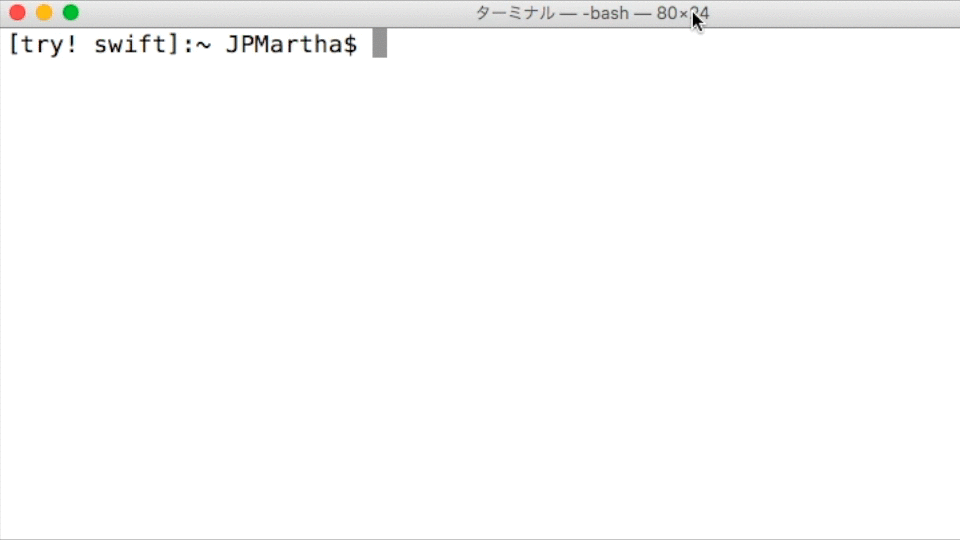

# README Generator 📄

_Is most of your documentation the same as your existing project's?_

### _Make Easy for You to Create a README.md of New Project_

- _**It duplicates an existing README.md**_
- _**It replaces strings (e.g. Name) in a README.md**_

<br />



<br />

## Example

Please prepare a target directory beforehand. (e.g. `DragonBall`)

```
HomeDirectory
├── Pokemon
│   └── README.md (Pokemon)
└── DragonBall
```

<br />

### Duplicating a README.md

```bash
$ tryswiftdev -d ./Pokemon ./DragonBall
```

```
HomeDirectory
├── Pokemon
│   └── README.md (Pokemon)
└── DragonBall
    └── README.md (Pokemon) ✨
```

<br />

### Replacing Strings in a README.md

```bash
$ cd DragonBall
$ tryswiftdev -r Pokemon DragonBall
```

```
HomeDirectory
├── Pokemon
│   └── README.md (Pokemon)
└── DragonBall
    └── README.md (DragonBall) ✨
```

<br />

### Result

```diff
1c1
< # Pokemon
---
> # DragonBall
3c3
< __Pokemon__ is a library written in Swift.
---
> __DragonBall__ is a library written in Swift.
9c9
< 1. Create a [Cartfile](https://github.com/Carthage/Carthage/blob/master/Documentation/Artifacts.md#cartfile), and add `github "JPMartha/Pokemon" ~> 1.0.0`.
---
> 1. Create a [Cartfile](https://github.com/Carthage/Carthage/blob/master/Documentation/Artifacts.md#cartfile), and add `github "JPMartha/DragonBall" ~> 1.0.0`.
11c11
< 3. On your application targets’ “Build Phases” settings tab, in the “Link Binary With Libraries” section, click the “+” icon and add `Pokemon.framework` from the Carthage/Build folder on disk.
---
> 3. On your application targets’ “Build Phases” settings tab, in the “Link Binary With Libraries” section, click the “+” icon and add `DragonBall.framework` from the Carthage/Build folder on disk.
16c16
<   and add the "Input Files" to Pokemon.framework:
---
>   and add the "Input Files" to DragonBall.framework:
18c18
<   $(SRCROOT)/Carthage/Build/iOS/Pokemon.framework
---
>   $(SRCROOT)/Carthage/Build/iOS/DragonBall.framework
29c29
<   pod 'Pokemon', '~> 1.0.0'
---
>   pod 'DragonBall', '~> 1.0.0'
42c42
< __Pokemon__ is released under the [MIT License](LICENSE).
---
> __DragonBall__ is released under the [MIT License](LICENSE).
```

<br />

## Availability

Recommented Swift 3.0-dev.

<br />

## License

Licensed under the [MIT License](LICENSE).
