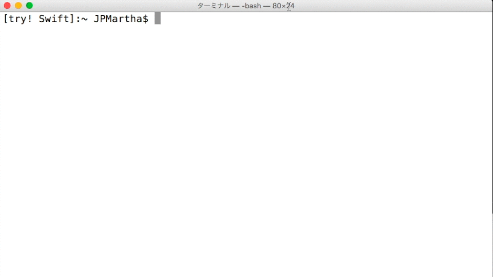

# try! Swift 3.0 🐣

### _Make Easy for You to Set Environment Variables Swift 3.0_

- _**You can change Swift Environments quickly. (Only Swift 2.2 -> Swift 3.0-dev)**_
  - _It's NOT necessary to change directory._
- _**No problem if executing this command twice**_
  - _It does NOT set an overlap value._

<br />



<br />

This is a shell script written in Bash and published by [_**@JPMartha_jp**_](https://twitter.com/JPMartha_jp) on April 10th, 2016.

For more information, please see _https://medium.com/@JPMartha/trying-managing-swift-environments-with-a-shell-bash-445d4f7e4c8#.3dqatwld7_.

<br />

## Installing

Please download the `tryswiftdev.pkg` in the [Releases](https://github.com/tryswift/tryswiftdev/releases) and install it.
  
Alternatively, please download the `tryswiftenv` in the [Releases](https://github.com/tryswift/tryswiftdev/releases) and move it into your `PATH` directory.

<br />

⚠️ _**PLEASE NOTE**: This is not **swiftenv**_.

> _**swiftenv**_
>
> swiftenv is a popular Swift Version Manager. It allows us to easily install, and switch between multiple versions of Swift. Here is the [support page](https://swiftenv.fuller.li/).
>
> A lot of popular libraries are using it. ☺️

<br />

## How to Use

Type the following command in a Terminal.app.

```bash
$ . tryswiftenv
```

⚠️ _**PLEASE NOTE**: Use .(a period) to inherit environment variables._

<br />

### Result

```bash
Before the change:

/Applications/Xcode.app/Contents/Developer/Toolchains/XcodeDefault.xctoolchain/usr/bin/swift
Apple Swift version 2.2 (swiftlang-703.0.18.1 clang-703.0.29)
Target: x86_64-apple-macosx10.9

PATH=/Library/Developer/Toolchains/swift-latest.xctoolchain/usr/bin:/usr/local/bin:/usr/bin:/bin:/usr/sbin:/sbin
TOOLCHAINS=swift
SWIFT_EXEC=/Library/Developer/Toolchains/swift-latest.xctoolchain/usr/bin/swiftc

After the change:

/Library/Developer/Toolchains/swift-DEVELOPMENT-SNAPSHOT-2016-05-09-a.xctoolchain/usr/bin/swift
Apple Swift version 3.0-dev (LLVM dffa09ffd8, Clang 9f0d189820, Swift 1c720b8f84)
Target: x86_64-apple-macosx10.9
```

<br />

## Requirement

- Bash
- Swift 3.0 Development Snapshots

<br />

## License

Licensed under the [MIT License](LICENSE).
