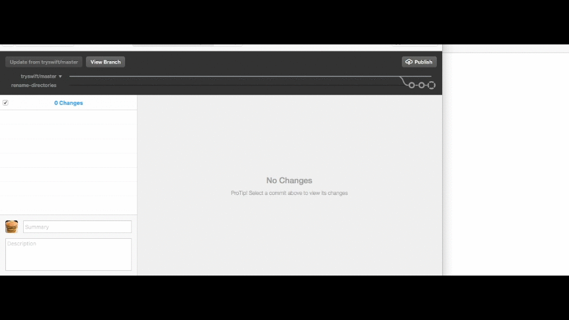

# Version Strings Updater ✨

### _**Make Easy for You to Update Version Strings in Specified Files**_

<br />



<br />

### A Work In Progress 👷

⚠️ **Please note!**

This is still in early design and development. 🙏

<br />

## Example

### Preparing for Update Version Strings

Please set the following format to your configuration file.

You can decide the name as you like. (e.g. `tryswiftdevuvs`, `tryswiftdev.uvs`)

```
<YourFilePath>, <RegularExpression>, <NewString>
```

- `<YourFilePath>`

  You can specify the relative path of files you want to update.
  
  And, please specify the (current) working directory when executing `tryswiftdev -u` command.

### A Specific Example (testTryswiftdev.uvs)

```
./FindIt.swift, \"TOOLCHAINS=org.swift.[0-9]\{10\}a\", \"TOOLCHAINS=org.swift.3020160503a\"
./FindIt.swift, swift-DEVELOPMENT-SNAPSHOT-[0-9]\{4\}-[0-9]\{2\}-[0-9]\{2\}-a, swift-DEVELOPMENT-SNAPSHOT-2016-05-03-a

./FindIt.md, swift-DEVELOPMENT-SNAPSHOT-[0-9]\{4\}-[0-9]\{2\}-[0-9]\{2\}-a, swift-DEVELOPMENT-SNAPSHOT-2016-05-03-a

./FindItTests.swift, swift-DEVELOPMENT-SNAPSHOT-[0-9]\{4\}-[0-9]\{2\}-[0-9]\{2\}-a, swift-DEVELOPMENT-SNAPSHOT-2016-05-03-a

./.travis.yml, osx_image:\ xcode[0-9].[0-9], osx_image:\ xcode7.3
./.travis.yml, swift-DEVELOPMENT-SNAPSHOT-[0-9]\{4\}-[0-9]\{2\}-[0-9]\{2\}-a, swift-DEVELOPMENT-SNAPSHOT-2016-05-03-a
```

<br />

### Executing Update via _tryswiftdev_

```
$ tryswiftdev -u <ConfigurationFileAbsolutePath> <WorkingDirectoryPath>
```

- `<ConfigurationFileAbsolutePath>`  
  
  Please specify the absolute path of your configuration file.

- `<WorkingDirectoryPath>`

  Please specify the (current) working directory when executing `tryswiftdev -u` command.

<br />

### Result

```diff
5,6c5,6
<     "TOOLCHAINS=org.swift.3020160425a",
<     "XCODE_DEFAULT_TOOLCHAIN_OVERRIDE=/Library/Developer/Toolchains/swift-DEVELOPMENT-SNAPSHOT-2016-05-03-a.xctoolchain",
---
>     "TOOLCHAINS=org.swift.3020160503a",
>     "XCODE_DEFAULT_TOOLCHAIN_OVERRIDE=/Library/Developer/Toolchains/swift-DEVELOPMENT-SNAPSHOT-2016-05-03-a.xctoolchain",

4c4
<   - /Library/Developer/Toolchains/swift-DEVELOPMENT-SNAPSHOT-2016-04-25-a.xctoolchain/usr/lib/sourcekitd.framework
---
>   - /Library/Developer/Toolchains/swift-DEVELOPMENT-SNAPSHOT-2016-05-03-a.xctoolchain/usr/lib/sourcekitd.framework
7c7
<   - /Library/Developer/Toolchains/swift-DEVELOPMENT-SNAPSHOT-2016-04-25-a.xctoolchain/usr/lib/swift/macosx
---
>   - /Library/Developer/Toolchains/swift-DEVELOPMENT-SNAPSHOT-2016-05-03-a.xctoolchain/usr/lib/swift/macosx
15c15
< - `/Library/Developer/Toolchains/swift-DEVELOPMENT-SNAPSHOT-2016-04-25-a.xctoolchain/usr/lib`
---
> - `/Library/Developer/Toolchains/swift-DEVELOPMENT-SNAPSHOT-2016-05-03-a.xctoolchain/usr/lib`
17c17
< Recommend swift-DEVELOPMENT-SNAPSHOT-2016-04-25-a.
---
> Recommend swift-DEVELOPMENT-SNAPSHOT-2016-05-03-a.

11c11
<         XCTAssertEqual(xcodebuildSettings["LD_RUNPATH_SEARCH_PATHS"], "/Library/Developer/Toolchains/swift-DEVELOPMENT-SNAPSHOT-2016-04-25-a.xctoolchain/usr/lib/swift/macosx")
---
>         XCTAssertEqual(xcodebuildSettings["LD_RUNPATH_SEARCH_PATHS"], "/Library/Developer/Toolchains/swift-DEVELOPMENT-SNAPSHOT-2016-05-03-a.xctoolchain/usr/lib/swift/macosx")
18c18
<             runpathSearchPaths: "/Library/Developer/Toolchains/swift-DEVELOPMENT-SNAPSHOT-2016-04-25-a.xctoolchain/usr/lib/swift/macosx",
---
>             runpathSearchPaths: "/Library/Developer/Toolchains/swift-DEVELOPMENT-SNAPSHOT-2016-05-03-a.xctoolchain/usr/lib/swift/macosx",

2c2
< osx_image: xcode7.2
---
> osx_image: xcode7.3
8c8
<   - export SWIFT_VERSION=swift-DEVELOPMENT-SNAPSHOT-2016-04-25-a
---
>   - export SWIFT_VERSION=swift-DEVELOPMENT-SNAPSHOT-2016-05-03-a
```

<br />

## Others

### CocoaPods Example

```
./tryswiftdev.podspec, s.version\ \ \ \ \ =\ \"[0-9].[0-9].[0-9]", s.version\ \ \ \ \ =\ \"2.0.0\"
./tryswiftdev.podspec, s.osx.deployment_target\ =\ \"[0-9]\{2\}.[0-9]\", s.osx.deployment_target\ =\ \"10.9\"
./tryswiftdev.podspec, s.ios.deployment_target\ =\ \"[0-9].[0-9]\", s.ios.deployment_target =\ \"8.0\"
./tryswiftdev.podspec, s.tvos.deployment_target\ =\ \"[0-9].[0-9]", s.tvos.deployment_target =\ \"9.0\"
./tryswiftdev.podspec, s.watchos.deployment_target\ =\ \"[0-9].[0-9]\", s.watchos.deployment_target\ =\ \"2.0\"
```

### Carthage Example

```
./Cartfile,  github\ \"ishkawa\/APIKit\"\ \"[0-9].[0-9].[0-9]\",  github\ \"ishkawa\/APIKit\"\ \"2.0.0\"
./Cartfile,  github\ \"ikesyo\/Himotoki\"\ \"[0-9].[0-9].[0-9]\",  github\ \"ikesyo\/Himotoki\"\ \"2.0.0\"
./Cartfile.private, github\ \"jspahrsummers\/xcconfigs\"\ \"[a-z0-9]\{7\}\", github\ \"jspahrsummers\/xcconfigs\"\ \"8ed0ba2\"
```

### swiftenv Example

```
./.swift-version, DEVELOPMENT-SNAPSHOT-[0-9]\{4\}-[0-9]\{2\}-[0-9]\{2\}-a, DEVELOPMENT-SNAPSHOT-2016-05-03-a
```

<br />

### Result

```diff
1c1
<   s.version      = "1.7.0"
---
>   s.version      = "2.0.0"
3,6c3,6
<   s.osx.deployment_target = "10.8"
<   s.ios.deployment_target = "7.0"
<   s.tvos.deployment_target = "8.0"
<   s.watchos.deployment_target = "1.1"
---
>   s.osx.deployment_target = "10.9"
>   s.ios.deployment_target = "8.0"
>   s.tvos.deployment_target = "9.0"
>   s.watchos.deployment_target = "2.0"

1,2c1,2
< github "ishkawa/APIKit" "1.7.0"
< github "ikesyo/Himotoki" "1.7.0"
---
> github "ishkawa/APIKit" "2.0.0"
> github "ikesyo/Himotoki" "2.0.0"

1c1
< github "jspahrsummers/xcconfigs" "7fe1cb3"
---
> github "jspahrsummers/xcconfigs" "8ed0ba2"

1c1
< DEVELOPMENT-SNAPSHOT-2016-04-25-a
---
> DEVELOPMENT-SNAPSHOT-2016-05-03-a
```

<br />

## Availability

Recommented Swift 3.0-dev.

<br />

## License

Licensed under the [MIT License](LICENSE).
