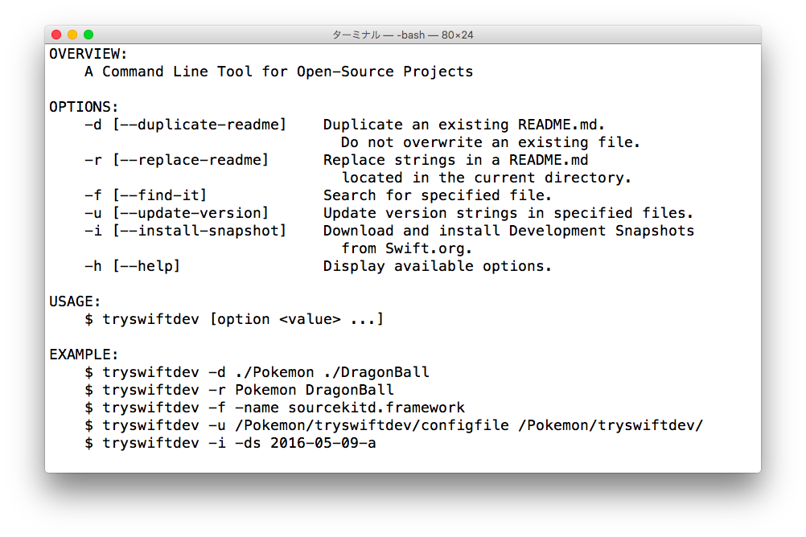

# tryswiftdev 🛠 [](https://travis-ci.org/tryswift/tryswiftdev)

**This is a command line tool for open-source projects.** 💁

<br />

### [_README Generator_](./Documentation/ReadmeGenerator.md)

_Is most of your documentation the same as your existing project's?_

#### _- Make Easy for You to Create a README.md of New Project_

### [_Find It_](./Documentation/FindIt.md)

#### _- Help You Out of "image not found"_

### [_Version Strings Updater_](./Documentation/VersionStringsUpdater.md)

#### _- Make Easy for You to Update Version Strings in Specified Files"_

<br />



<br />

### A Work In Progress

This project has been rewriting in _**Swift**_.

It is built with the _**Swift Package Manager**_.

Maybe it is easily to write a shell (e.g. Bash), _but this is exactly **"try! Swift"**._

Currently, support **OS X only**. 🙏

<br />

## Options

```
-d [--duplicate-readme]    Duplicate an existing README.md.
                            Do not overwrite an existing file.
-r [--replace-readme]      Replace strings in a README.md
                            located in the current directory.
-f [--find-it]             Search for specified file.
-u [--update-version]      Update version strings in specified files. ✨
-h [--help]                Display available options.
```

### _README Generator_

Please see [_**README Generator**_](./Documentation/ReadmeGenerator.md).

### _Find It_

Please see [_**Find It**_](./Documentation/FindIt.md).

### _Version Strings Updater_

Please see [_**Find It**_](./Documentation/VersionStringsUpdater.md).

<br />

## Installing

Please download the `tryswiftdev.pkg` in the [Releases](https://github.com/tryswift/tryswiftdev/releases) and install it.

_**This is a test release. It has not gone through the testing.**_

By default, get `tryswiftdev` into the `/usr/local/bin/` directory.

You can verify your installation by typing `tryswiftdev` in a Terminal.app.

```
$ tryswiftdev
```

<br />

## Availability

Swift 3.0-dev

<br />

## ToDo

- [ ] Error Handling
- [ ] Tests

etc.

<br />

## License

Licensed under the [MIT License](LICENSE).
